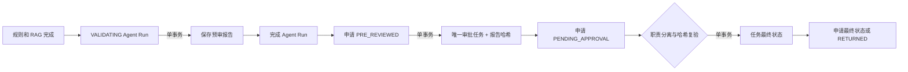

# 身份、审批与审计治理

## 身份与访问边界

FinCredit Copilot v1.0 只接受 `demo-header` 与 `oidc` 两个显式身份提供方。拼写错误或未知 Provider 会返回 `503`，不会退回演示用户表。OIDC 模式要求标准 `Authorization: Bearer <token>`，根据 JWT Header 的 `kid` 从企业 JWKS 选择公钥，并同时校验算法白名单、签发方、受众、签名、有效期和必需声明。

设置 `FINCREDIT_ENVIRONMENT=production` 时，`GET /ready` 会拒绝 `demo-header`，并要求正式 Embedding 与 pgvector。只有 Token 中映射到项目业务角色且带有效组织声明的身份才会进入授权层。风险经理与审批人只能访问申请创建人所属组织的数据，合规管理员保留全局审计权限；客户经理只能访问本人创建的申请。

## 事务边界



以下状态组合在同一 SQLite `BEGIN IMMEDIATE` 事务中提交：

- 预审报告、Agent Run 最终输出/事件、申请 `pre_reviewed` 状态；
- 唯一审批任务、报告 SHA-256、申请 `pending_approval` 状态；
- 人工决策、审批任务状态、申请 `approved`/`rejected`/`returned` 状态。

更新语句携带预期状态条件；重复提交、重复决策或并发状态变化返回 `409`。退回申请必须重新执行预审，生成新的报告后才能再次提交；每次重提生成新的 `APR-<application>-<suffix>`，不覆盖历史任务。

## 职责分离与证据锁定

最终审批人不得与以下任一人员相同：

- 申请创建人；
- 预审报告创建人；
- 审批提交人。

提交审批时记录当前预审报告原始 JSON 的 SHA-256。决策前重新计算摘要；如报告已被修改，系统拒绝决策，要求退回并重新提交。

## 防篡改审计链

每个审计事件包含 `prev_hash` 与 `event_hash`。当前事件摘要覆盖上一事件摘要、动作、操作者、资源、详情和时间戳：

```text
event_hash = SHA256(prev_hash + canonical_event_payload)
```

合规管理员可调用 `GET /v1/audit-events/integrity` 检查完整链；响应包含事件数、链头摘要和首个异常事件编号。迁移会为旧事件补齐摘要。

该机制用于发现本地数据被修改，不能阻止拥有数据库写权限的攻击者同时重算整条链。生产环境必须把链头或完整事件实时复制到独立 WORM、SIEM 或可信时间戳服务。
