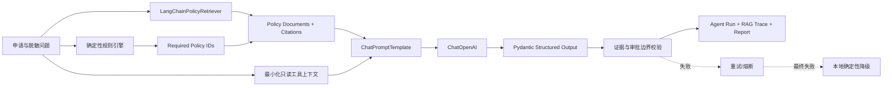

# LangChain 与 RAG 优化说明

## 目标与边界

FinCredit Copilot v0.5 将模型编排和政策检索统一在 LangChain 标准接口下，同时保留配置化且受四眼发布治理的确定性授信规则。大模型用于解释、归纳和生成草稿，不负责批准、拒绝、退回或改变申请状态。

这里的“RAG 微调”指分块、召回、融合权重、阈值、Top-K 和重排参数的离线调优。当前版本没有声称训练 OpenAI、DeepSeek 或其他基础模型权重。

## 结构



主要模块：

- `app/rag/contracts.py`：RAG 配置、命中和追踪契约。
- `app/rag/retriever.py`：LangChain `BaseRetriever` 适配器。
- `app/rag/service.py`：检索结果与确定性规则证据合并。
- `app/rag/tuning.py`：Hit Rate、Recall、MRR 评测与参数网格搜索。
- `app/agent_provider.py`：LCEL 模型链和外部 Provider 适配。
- `app/agent_output.py`：Pydantic 输出模型、证据约束和审批边界校验。
- `app/embedding.py`：开发用哈希向量与正式 OpenAI Embedding 适配器。
- `app/vector_store.py`：内存与 `langchain-postgres`/pgvector 适配器。

## 检索策略

每个政策条款先按稳定句段切分并生成引用信息。检索分数由词法分数和向量余弦相似度归一化融合：

```text
score = normalized_lexical_score * lexical_weight
      + max(vector_score, 0) * vector_weight
```

当前演示调优值：

| 参数 | 值 |
| --- | ---: |
| `top_k` | 3 |
| `lexical_weight` | 0.85 |
| `vector_weight` | 0.15 |
| `min_vector_score` | 0.0 |
| `chunk_size` | 180 |

确定性规则直接引用的政策编号属于强制证据：即使语义检索未命中，也会附加到证据链并在 RAG Trace 标记 `forced_match=true`。这避免把强制合规证据完全交给概率检索决定。

开发默认使用可复现的 `hash-local`，正式路径使用 OpenAI `text-embedding-3-small` 和可配置 `dimensions`。政策、切分尺寸、模型或向量维度共同形成索引指纹；指纹未变化时跨请求复用索引。pgvector 使用稳定文档 ID、集合 manifest 和 advisory lock，先写入新快照再删除旧 chunk。

## 执行调优

评估当前环境配置：

```powershell
python scripts\tune_rag.py --evaluate-current
```

执行 36 组参数网格搜索：

```powershell
python scripts\tune_rag.py
```

保存结果：

```powershell
python scripts\tune_rag.py --output artifacts\rag-tuning.json
```

评测数据位于 `demo_data/rag_evaluation.json`。新增数据时至少提供稳定的 `id`、脱敏 `query` 和一个或多个 `expected_policy_ids`。真实上线前应将数据拆分为训练、验证和时间外测试集，防止在小样本上过拟合。

## 模型调用

OpenAI 和 DeepSeek 都通过 LangChain `ChatOpenAI` 适配器调用：

- OpenAI 使用 Responses API 模式和 `json_schema` 结构化输出。
- DeepSeek 使用 OpenAI 兼容 Base URL 和 `json_mode`。
- LangChain 内部重试关闭，由项目统一的超时、重试和熔断器负责。
- 最终失败后生成本地确定性输出，并记录 `runtime=langchain`、`fallback=true` 和降级原因类型。

## 数据最小化

进入模型上下文的材料工具结果仅包含材料类型、字节数、SHA-256 和已抽取字段名。原始正文及 `text_preview` 不会通过 Agent 工具发送给外部模型。政策正文会进入模型上下文，因为它是 RAG 的受控知识来源。

## 发布门禁

`scripts/release_gate.py` 会同时运行：

1. 场景质量门禁；
2. 确定性 Agent 输出评测；
3. 当前 RAG 配置的 Hit Rate、Recall 和 MRR 评测。

任何 RAG Hit Rate 低于 `1.0`、Recall 低于 `0.95` 或 MRR 低于 `0.75` 的版本都会阻止发布。

## 后续路线

- 为向量集合加入租户、政策生效区间和数据分级过滤。
- 建立 Embedding 模型升级的双索引灰度、离线对比和回滚流程。
- 将规则到期激活从请求边界迁移到受监控调度器，并增加发布 SLA 告警。
- 引入经合规审批的难负样本、冲突政策、多跳查询和时间有效性测试。
- 若确需基础模型微调，另建数据治理、训练作业、模型注册、灰度、回滚和偏差评估流程。

## 参考

- [LangChain Agents](https://docs.langchain.com/oss/python/langchain/agents)
- [LangChain structured output](https://docs.langchain.com/oss/python/langchain/structured-output)
- [LangChain semantic search and retrievers](https://docs.langchain.com/oss/python/langchain/knowledge-base)
