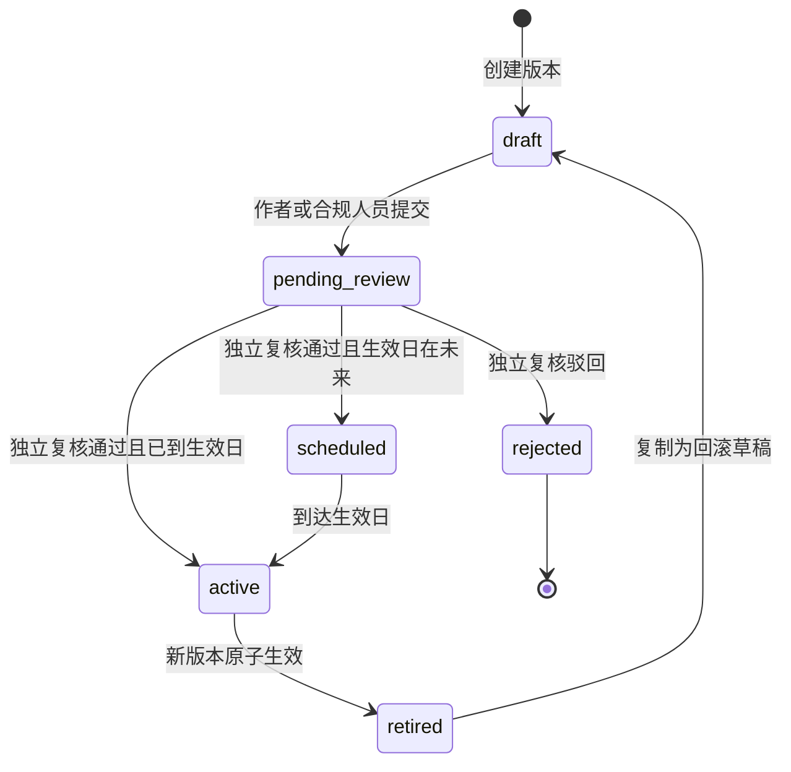

# 政策规则发布生命周期

FinCredit Copilot v1.1 保留可执行规则的四眼发布状态机。规则正文不执行任意代码，只能进入四种白名单解释器；发布权限与授信审批权限相互独立，Agent 任务规划不能绕过这些确定性规则。

## 状态机



同一规则 ID 最多存在一个 `active` 和一个 `scheduled` 版本。草稿一旦创建即不可原位修改；修订必须使用新版本号。规则作者或提交人不能审批自己的版本。

## API 流程

1. `POST /v1/knowledge/rules`：创建 `draft`。
2. `GET /v1/knowledge/rules/{id}/versions/{version}/diff`：查看相对当前生效/最近已批准版的结构化变化。
3. `POST /v1/knowledge/rules/{id}/versions/{version}/submit`：进入 `pending_review`。
4. `POST /v1/knowledge/rules/{id}/versions/{version}/decision`：由不同合规人员提交 `approved` 或 `rejected` 及意见。
5. `GET /v1/knowledge/rules?include_inactive=true`：查询完整版本和职责链。

批准请求示例：

```json
{
  "decision": "approved",
  "comment": "已复核政策依据、阈值边界、样本回放与生效日期。"
}
```

## 内容锁定与差异复核

创建草稿时，系统对规则 ID、关联政策、版本、解释器、参数、严重度、输出消息、生效日和来源进行 canonical JSON 序列化并计算 SHA-256。审批前再次计算；任何内容变化都会阻止审批，要求重新创建版本。草稿、提交、审批、驳回、回滚草稿与计划激活均在各自状态事务内追加审计哈希链事件，避免状态已变化但审计未落库。

Diff 返回基线版本、候选状态、候选内容哈希、`content_hash_valid`，以及每个变化字段的 `from`/`to`。复核人应把 diff、政策原文、离线评测结果和变更单号一并纳入审批证据。

## 计划生效

批准未来日期版本时状态为 `scheduled`，当前活动版本继续工作。到达 `FINCREDIT_POLICY_TIMEZONE` 指定业务时区的生效日期后，首次规则读取在短 `BEGIN IMMEDIATE` 事务中停用旧版、启用计划版，并在同一事务写入 `policy_rule_scheduled_activated` 审计事件。没有到期任务时，普通规则读取只使用读事务。

多实例生产部署应把到期扫描迁移到单独的受监控调度器；数据库唯一索引仍负责保证每个规则只有一个活动版和一个计划版。

## 受控回滚

`POST /v1/knowledge/rules/{id}/rollback` 接受目标历史版本、新版本号、生效日和回滚原因。系统复制目标内容生成新 `draft`，不会直接重新激活旧行；随后仍需提交和独立复核。因此，紧急回滚保留新的版本号、责任人、原因、内容哈希和完整审计轨迹。

```json
{
  "target_version": "2026.01",
  "new_version": "2026.01-r1",
  "effective_date": "2026-09-15",
  "reason": "新阈值在回放集上出现异常拦截，回退到最近稳定版本。"
}
```

当前 SQLite 实现用于演示事务与治理语义。生产接入时应迁移到 PostgreSQL 行锁、外部不可变审计平台和告警调度器。
